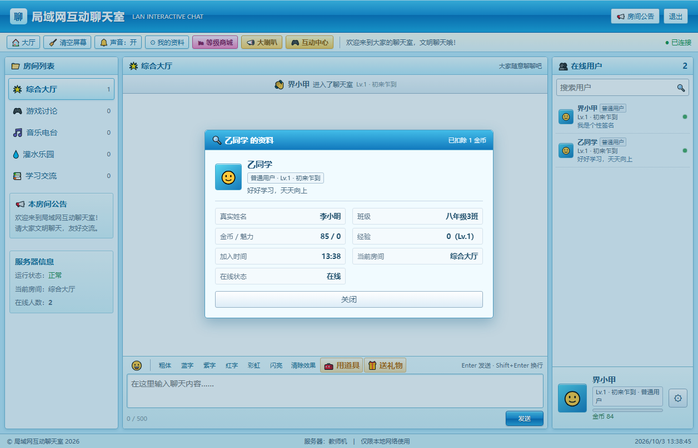
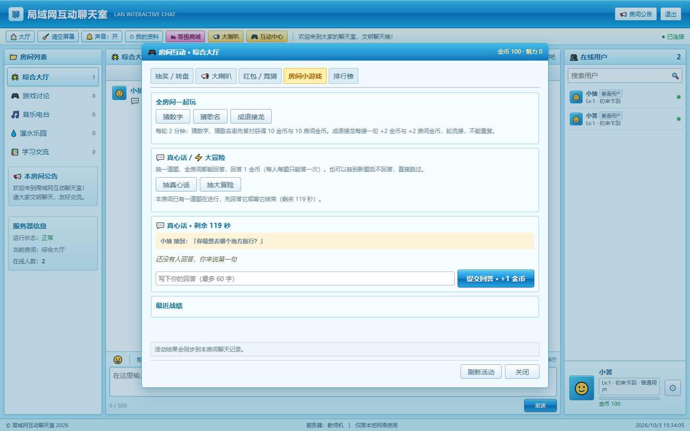
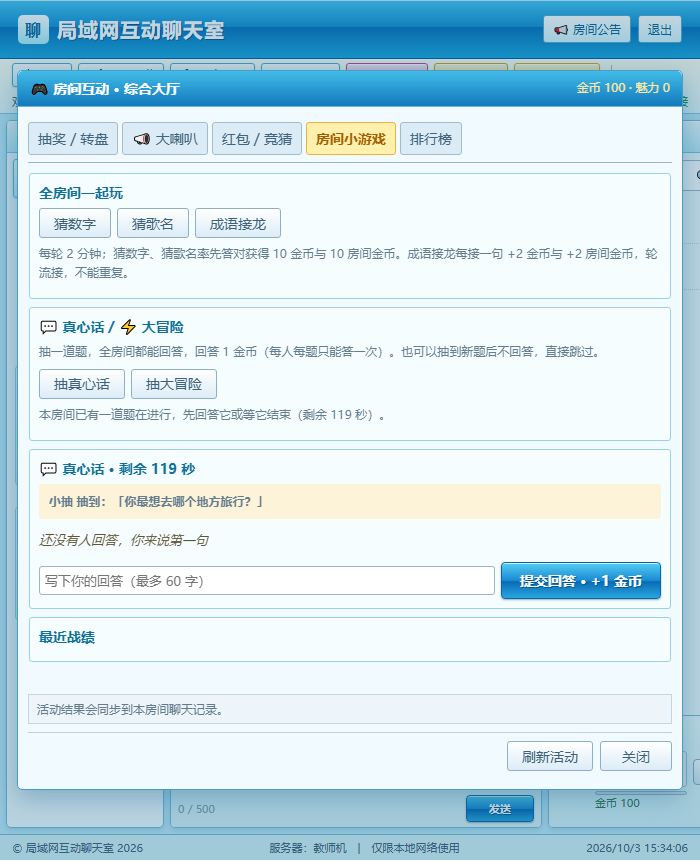
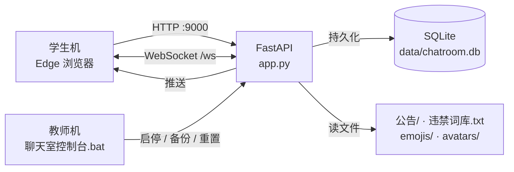

# 局域网互动聊天室


> **一台教师机跑服务，学生机开浏览器就能用。** 不需要外网、不需要服务器、不需要配置域名 —— 双击一个 `.bat` 就部署完成。

面向中小学机房的局域网聊天室。用外网的社交软件组织课堂讨论，既要装客户端、又管不住内容；
这个项目把「服务端 + 前端 + 运维控制台」打包成一个文件夹，教师机放上去，学生机用 Edge 打开 `http://教师机IP:9000` 即可。



---

## 功能

### 聊天与房间

- 五个公共房间：**综合大厅 / 游戏讨论 / 音乐电台 / 灌水乐园 / 学习交流**，各自独立的消息记录与在线人数
- WebSocket 实时收发，多房间自由切换，断线自动重连
- 私聊、@提醒、在线用户列表与人数统计
- 自定义聊天表情与头像：往 `emojis/`、`avatars/` 丢图片即生效，无需改代码
- 文字样式：粗体、签章、篆字、红字、彩虹、闪亮
- 注册账号 / 游客进入；注册用户等级、金币、道具持久化，游客为临时身份

### 权限与治理

身份一共三种（`admin` / `user` / `guest`），**「房主」不是第四种身份**，而是「某个人 × 某个房间」的一条授权：

| 角色 | 能做什么 |
|---|---|
| **管理员** | 全站禁言、踢人、删消息、任命房主、管理任意房间公告 |
| **房主**（限于授权的那个房间） | 改本房间公告、在本房间禁言 / 解除禁言 |
| **普通用户** | 聊天、私聊、送礼、玩全部互动玩法 |
| **游客** | 聊天与答题类玩法（无金币，用不了消耗金币的功能） |

- **禁言分两层**：`全站禁言`（仅管理员，所有房间生效）与 `本房间禁言`（管理员或本房间房主）。两者互不干扰。
- 房主授权**落库**，重启服务后依然有效；一个房间最多 5 位房主，房主在别的房间就是普通用户。

### 互动中心（小游戏）

抽奖、转盘、大喇叭、红包、竞猜、猜数字、猜歌名、成语接龙、真心话 / 大冒险。

- **活动消息自动分档，不刷屏**：抢红包、竞猜投票、接龙、抽奖这类「一人刷一条」的流水会折叠成一条
  `活动消息 N 条` 的带子；开局、开奖、答对、大喇叭这些低频事件照常单独显示。
- ★ **真心话 / 大冒险刻意不折叠** —— 它们是「等人回应」的事件，折进带子就等于没人知道有题在等。
- 判据集中在 `app.py` 的 `ACTIVITY_STREAM_KINDS`，**忘记登记也不会把消息藏起来**（未登记一律按单独显示处理）。

### 等级与经济

- 每条正常消息 **+2 经验 / +1 金币**，每升一级额外奖励 10 金币，等级每 50 经验一档并显示称号
- 等级商城：礼物、徽章、宠物用品三类；礼物可送人，徽章可佩戴（昵称旁的小图标）
- 个人虚拟宠物：5 级后可免费领养，状态（饥饿 / 口渴 / 清洁度）随时间下降，需用商城道具维护
- 金币榜、财富榜、魅力榜、房间活跃榜
- 刷币防线集中在 `income_gate_open()` 一处，礼物与发言共用同一道冷却闸门

### 内容安全

- 违禁词**词库外置**在根目录 `违禁词库.txt`，记事本改完存盘即生效，**不用重启服务**
- 屏蔽时发言者扣 5 金币并收到系统提示；同一会话连续 3 次违规自动禁言 1 分钟
- 支持插空格 / 插标点 / 全角字母等规避写法，无需为每种写法各写一行
- 内置误伤保护（「他妈妈是老师」「我妈的病好多了」「USB 接口」等不会被误拦）
- 昵称与聊天内容走同一套审核规则
- 房间公告**每房间一份**，房主改自己房间那份、老师直接改文件，**两个入口指向同一个文件**

### 运维

根目录的 **`聊天室控制台.bat`** 提供一个图形控制台（tkinter），双击即用：
启动 / 停止 / 重启 / 打开聊天室、成员列表（含重置学生密码、导出 CSV）、清空聊天记录、备份与恢复、重置数据。

- **破坏性操作前一律自动备份到项目外**，备份失败就中止，不会出现「删了但没备份」
- 「清空聊天记录」只删 `messages` 表，**账号 / 金币 / 等级 / 道具全部保留**，且不必停服务
- 「备份与恢复」按时间点整体回退，还原前会先把当前状态另存一份（后悔药）

---

## 界面速览

**互动中心** —— 抽奖 / 转盘 / 红包 / 竞猜 / 房间小游戏 / 排行榜，活动结果同步到聊天区：



**窄屏自适应** —— 机房小屏或分屏时自动切换布局：



---

## 技术栈

| 层 | 选型 |
|---|---|
| 服务端 | Python 3.11+ · FastAPI 0.115 · Uvicorn 0.34 · WebSocket |
| 前端 | Vue 3.5 · Vite 6（构建产物已入库，**运行时不需要 Node.js**） |
| 存储 | SQLite（单文件） |
| 部署形态 | Windows 单机，纯内网，无外部依赖 |

### 请求怎么走



没有中间件、没有消息队列、没有外部数据库 —— 55 台学生机的文字聊天并发在单进程设计范围内。

---

## 快速开始

### 教师机（服务端）

1. 安装 **Python 3.11 或更高版本**（安装时勾选 *Add Python to PATH*）
2. 在本文件夹内**双击 `聊天室控制台.bat`**
3. 首次运行会自动创建虚拟环境并安装依赖（需要能访问 pip 源，仅第一次）
4. 弹出控制台窗口后点 **「启动服务」**，状态灯变绿即就绪
5. 点 **「打开聊天室」** 在本机验证

> 管理员不需要单独入口，在首页「登录账号」标签里登录即可。
> 可在启动前设置环境变量 `CHAT_ADMIN_USER` / `CHAT_ADMIN_PASSWORD` 修改管理员账号密码。

### 学生机（客户端）

学生机只需要一个浏览器（推荐 Edge），访问教师机的局域网 IP：

```text
http://教师机IP:9000
```

教师机 IP 可在命令提示符运行 `ipconfig` 查看（IPv4 地址）。

### 如果学生机打不开

- 首次启动时允许 Python 通过 Windows 防火墙的**「专用网络」**
- 或在防火墙入站规则中放行 **TCP 9000** 端口
- 确认学生机与教师机在同一网段（同一路由器 / 交换机下）

---

## 项目结构

```text
局域网聊天室/
├── app.py                    # 服务端主程序：路由、WebSocket、会话与权限、SQLite、违禁词过滤（3165 行）
├── interactions.py           # 互动中心：抽奖 / 转盘 / 红包 / 竞猜 / 接龙等玩法（511 行）
├── launcher.py               # 控制台窗口（tkinter）：启停 / 备份 / 重置 / 成员列表（1291 行）
├── manage.py                 # 命令行工具：start / stop / backup / restore / reset / clear-messages / passwd（1314 行）
├── 聊天室控制台.bat           # 教师机双击入口
├── 全量检查.bat               # 双击跑四层自检
├── frontend/                 # 前端源码（Vue 3 + Vite）
│   ├── index.html
│   └── src/
│       ├── App.vue               # 主界面：聊天区 / 房间列表 / 在线用户 / 工具栏（1346 行）
│       ├── ChatText.vue          # 消息正文渲染（表情短代码、@、违规打码）
│       ├── InventoryPanel.vue    # 物品栏
│       ├── RoomActivities.vue    # 互动中心面板
│       ├── main.js
│       └── style.css
├── static/
│   ├── dist/                 # 前端构建产物，服务运行时直接读这里
│   └── pets/                 # 宠物 SVG 素材
├── tests/                    # full_check.py 四层自检（2405 行）+ 13 个 test_*.py
├── docs/                     # 使用手册与截图
├── emojis/                   # 自定义聊天表情（丢图片即生效）
├── avatars/                  # 自定义头像（丢图片即生效）
├── 公告/                     # 每房间一份公告：lobby / games / music / water / study.txt
├── 违禁词库.txt              # 违禁词词库（记事本维护，存盘即生效）
└── data/                     # SQLite 数据库与运行期数据（已 gitignore）
```

---

## 开发

### 前端

改了 `frontend/src/` 下的源码后**必须重新构建**，服务运行时读的是 `static/dist/`：

```bash
npm install          # 首次
npm run build        # 输出到 static/dist/
```

开发时可用热更新模式，已配好到 `127.0.0.1:9000` 的接口与 WebSocket 代理：

```bash
npm run dev
```

### 后端

直接用虚拟环境里的解释器运行，不要用系统 Python：

```bat
.venv\Scripts\python.exe manage.py start     :: 后台启动
.venv\Scripts\python.exe manage.py status    :: 查看服务状态
.venv\Scripts\python.exe manage.py stop      :: 停止
```

### 自检

改动过代码后，双击 **`全量检查.bat`**，或在命令行：

```bat
.venv\Scripts\python.exe tests\full_check.py            :: 跑全部四层
.venv\Scripts\python.exe tests\full_check.py --only L1  :: 只跑静态检查，1 秒内
.venv\Scripts\python.exe tests\full_check.py --no-gui   :: 无桌面环境时跳过控制台层
```

| 层 | 覆盖 |
|---|---|
| **L1 静态** | 语法编译、顶层重复定义、`.bat` 是否纯 ASCII、前端产物齐全性、词库与内置词库一致性、权限清单、活动分档清单、只读接口鉴权 |
| **L2 单元** | `tests/test_*.py` 全部用例（新增文件自动带上） |
| **L3 端到端** | 临时目录起真实服务：HTTP 接口、按房间公告、房主越权拦截、禁言隔离、分档一致、WebSocket 收发、违禁词打码 |
| **L4 控制台** | 主窗口按钮布局、成员列表完整流程、CSV 导出的表头与防公式注入、重置密码真的写库 |

**跑这个很安全**：服务与数据库都在系统临时目录里新建，全程不碰 `data/chatroom.db`、不占用 9000 端口，跑完自动清理。
退出码 `0` 全过、`1` 有失败、`2` 参数或环境不对。

---

## 配置项

| 环境变量 | 作用 | 默认 |
|---|---|---|
| `CHAT_ADMIN_USER` | 管理员账号 | `admin` |
| `CHAT_ADMIN_PASSWORD` | 管理员密码 | 首次启动时创建 |
| `CHAT_ANNOUNCE_DIR` | 房间公告目录 | 项目根目录 `公告/` |

---

## 文档

完整的操作说明（控制台每个按钮干什么、公告怎么维护、备份怎么还原、违禁词库怎么写、
房主怎么用、小游戏规则、命令行等价物、常见问题）都在这里：

👉 **[docs/使用手册.md](docs/使用手册.md)**

---

## 已知边界

- 单进程设计，面向**一个机房**（约 55 台并发）；不适用于跨校区大并发场景
- 明文 HTTP，**仅在封闭内网使用**，请勿直接暴露到公网
- 密码使用 PBKDF2 单向哈希（12 万轮），**不可逆** —— 学生忘记密码只能由老师重置
- 前端构建产物已入库。如果你只是部署使用，**不需要装 Node.js**；要改前端才需要
- 宠物素材目前是可替换的像素风 SVG 占位图，位于 `static/pets/`

---

## 许可

本项目暂未指定开源协议。如需正式授权条款，请先补充 `LICENSE` 文件。
